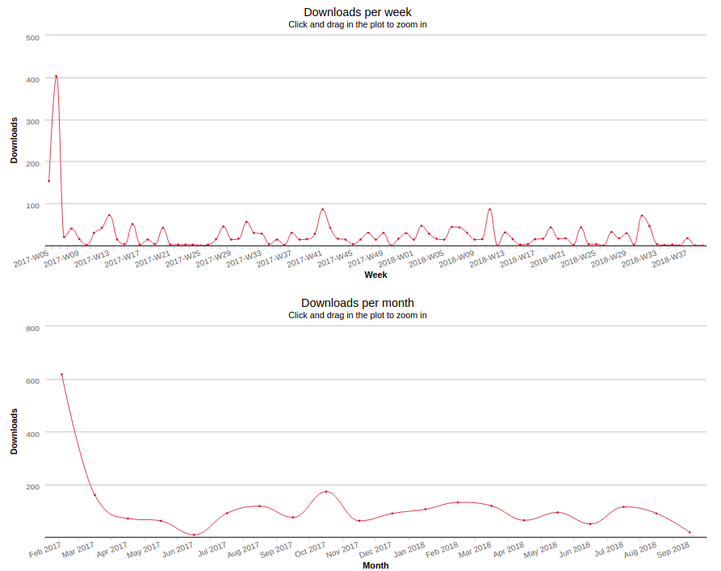
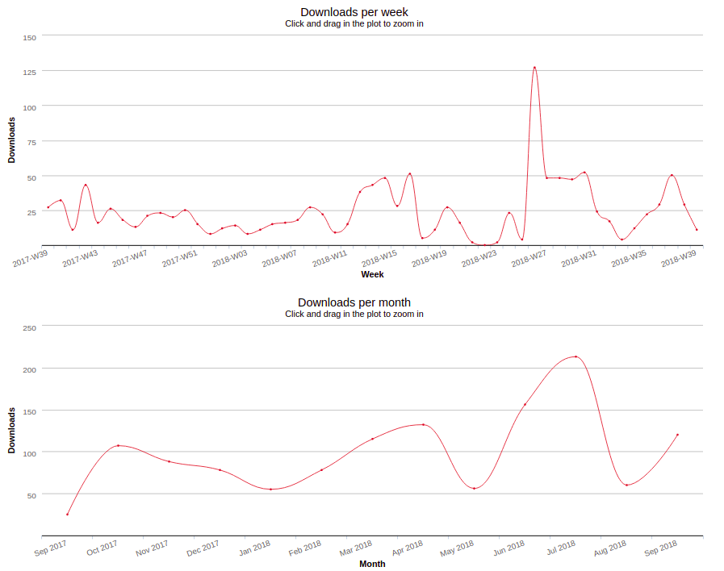
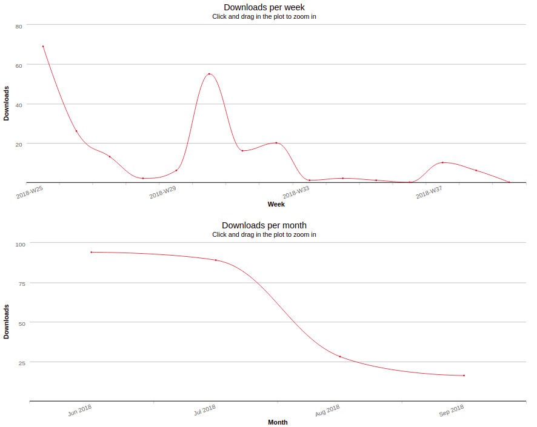
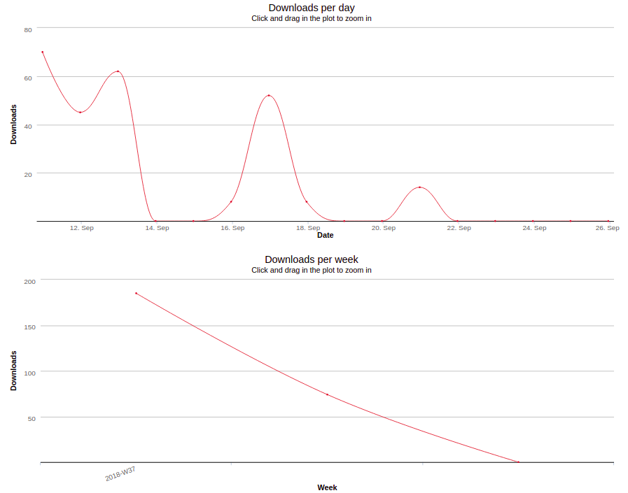
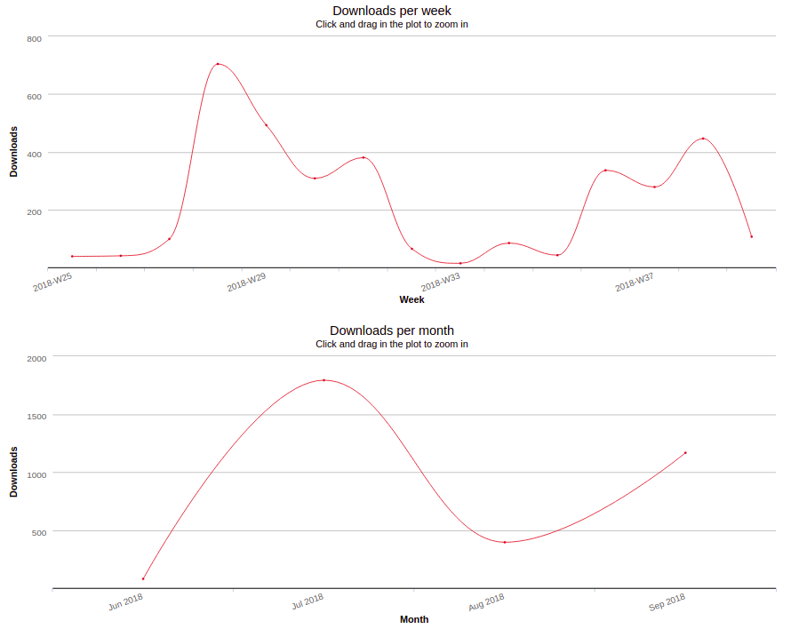
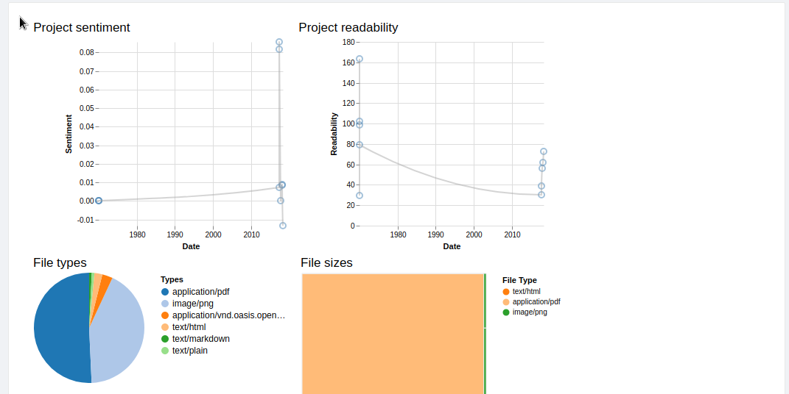
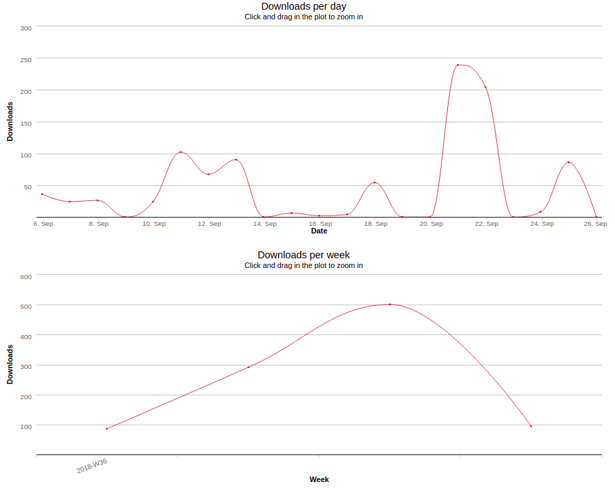
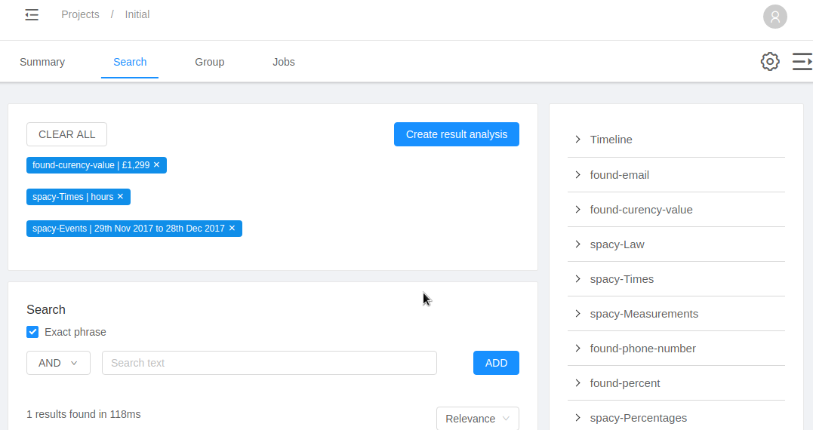
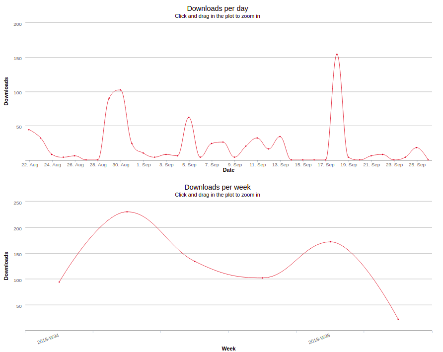
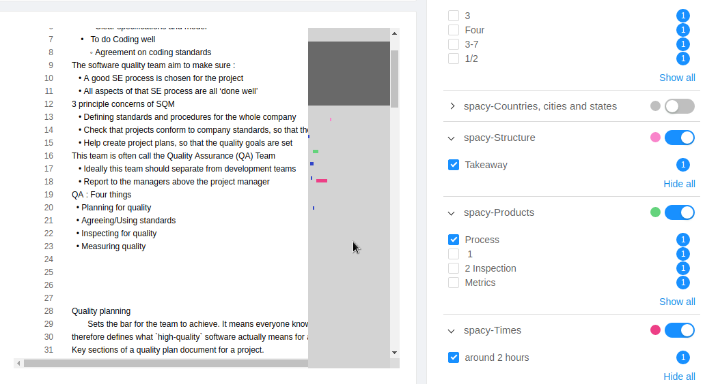

# Augustinas Jokubauskas (psyaj1)

## Notes
When looking at github commits, some might say username of Knightls or Augustinas, that happened because I had github configured incorrectly.

All the charts are taken from https://npm-stat.com

## dlister

Created: 05/02/2017

Downloads between 05/02/2017 and 26/09/2018: **2297**

Github: https://github.com/WhoAteDaCake/dlister

npm: https://www.npmjs.com/package/dlister

### Stats



### Example

```
[august@augustPc][components] $ dlister
├──antd
│  ├──Badge
│  │  └──index.js
│  ├──Collapse
│  │  ├──index.js
│  │  └──style.js
│  ├──DatePicker
│  │  └──index.js
│  ├──JobState
│  │  ├──index.js
│  │  └──style.js
│  ├──MenuItem
│  │  └──index.js
│  ├──Popconfirm
│  │  └──index.js
│  ├──Table
│  │  └──index.js
│  ├──Timeline
│  │  └──index.js
│  └──main.js
├──form
│  ├──Checkbox
│  │  └──index.js
│  ├──DragDrop
│  │  ├──Card.js
│  │  ├──Container.js
│  │  └──index.js
│  ├──Dropdown
│  │  └──index.js
│  ├──ScrollList
│  │  ├──index.js
│  │  └──style.js
│  ├──Switch
│  │  └──index.js
│  ├──TextArea
│  │  └──index.js
│  ├──TextField
│  │  └──index.js
│  └──main.js
├──hoc.js
├──main.js
├──manager
│  ├──ChartManager
│  │  ├──index.js
│  │  └──utils.js
│  ├──Responsive
│  │  ├──ResponsiveConsumer.js
│  │  ├──ResponsiveProvider.js
│  │  ├──breakpoints.js
│  │  ├──context.js
│  │  ├──getQueries.js
│  │  └──index.js
│  ├──TableManager
│  │  ├──TableFilter.js
│  │  ├──TableProvider.js
│  │  ├──TableSubscriber.js
│  │  ├──context.js
│  │  ├──core.js
│  │  └──index.js
│  └──main.js
└──ui
   ├──Loading.js
   ├──ProgressBar.js
   ├──SidebarToggle
   │  ├──index.js
   │  └──style.js
   └──main.js
[august@augustPc][components] $ dlister --help
--a : Adds a given expression to ignore list
--ci : Overlooks ignore list and only ignores given expressions
--cj : Joins given argument list with the ignore list
--i : Overlooks ignore list
--r : Removes given expressions from ignore list
--l : Lists current ignore list
--help : Lists available commands
--so : Adds left padding of 4 spaces
```

### About

This was my first published npm package, it was made because I found that there were no directory tree lister that suited my needs. The main issue was that when posting to stackoverflow, you would need to manually indent every line by 4 spaces, so I wrote a package that does that for me.

## react-routes-map

Created: 27/09/2017

Downloads between 27/09/2017 and 26/09/2018: **1283**

Github: https://github.com/WhoAteDaCake/dlister

npm: https://www.npmjs.com/package/react-router-map

### Stats



### Examples

```javascript
import mapRoutes from 'react-routes-map';

import { Loading } from '@spotlightdata/nanowire-extensions';
import { paths } from './paths';

/**
 * @class
 * Route configuration:
 *
 * @param {string | bool} path
 * Absolute path to component
 * Is false if the component is the 404 path
 *
 * @param {string} component
 * Filename of the component
 * File should be placed inside /routes, however, it can be elsewhere
 * Keep in mind that the path will be relative to /routes
 *
 * @param {string} name
 * Default name that will be displayed in the Header
 *
 * @param {?Array<Route>} children
 * Components of which path will be relative to parent path
 *
 * @example
 *{
 *  path: '/home',
 *  component: 'Home',
 *  name: 'Home page',
 *}
 */

const specification = [
  {
    path: `/${paths.login.all}`,
    component: 'Login',
  },
  {
    path: `/${paths.home.all}`,
    component: 'Home',
  },
  {
    path: `/${paths.support.all}`,
    component: 'Support',
  },
  {
    path: false,
    component: 'NotFound',
  },
];

const options = {
  loader: component => {
    return import(`./${component}`)
      .catch(() => import(`./${component}/index.js`))
      .catch(() => import(`./NotFound.js`));
  },
  Loading,
};

export const routes = mapRoutes(specification, options);
```

### About
I created this package when while working on multiple react projects. While working with react I realised that without routing, generated JavaScript bundles used to run pages would be way too large and dynamic route loading was way harder than it needed to be.

## color-re

Created: 19/06/2018

Downloads between 19/06/2018 and 26/09/2018: **227**

Github: https://github.com/WhoAteDaCake/color-re

npm: https://www.npmjs.com/package/color-re

### Stats




### Example

```ocaml
/* Change the opacity */
Color.(fromRgb((200, 200, 200)) |> opacity(1.5) |> toString) |> Js.log
Color.(fromRgb((200, 200, 200)) |> toHsl |> fade(0.5) |> toString) |> Js.log
Color.(fromRgb((200, 200, 200)) |> toHsl |> opaquer(0.4) |> toString) |> Js.log

/* Color convertions */
Color.(fromRgb((200, 200, 200)) |> toHex |> toHsl |> toHsv |> toString) |> Js.log

/* Color properties */
Color.(fromRgb((200, 200, 200)) |> luminosity) |> Belt.Option.getExn |> Js.log
Color.(fromRgb((200, 200, 200)) |> contrast(fromHex("#aaafff"))) |> Belt.Option.getExn |> Js.log
```


### About

This package was created as part of learning experience for reasonml, new language written by facebook. I've been part of reasonml community for few months now and I have noticed that it was missing a lot crucial packages for web development. So I took upon myself to help the community and ported this package from JavaScript one.

## @atecake/builder

Created 11/09/2018

Downloads between 11/09/2018 and 26/09/2018: 259

Github: https://github.com/WhoAteDaCake/builder

npm: https://www.npmjs.com/package/@atecake/builder

### Stats



### Example

```javascript
const {
  start,
  devServer,
  when,
  bundle,
  library,
  configure,
  customise,
  tag,
  tap,
} = require('@atecake/builder');

const pkg = require('./package.json');

start([
  configure(),
  when('build', [
    bundle({ files: { input: 'src/index.js', output: pkg.main } }),
    bundle({
      files: { input: 'src/index.js', output: pkg.module },
      build: { rollup: { format: 'esm' } },
      action: Promise.resolve(),
    }),
    library({
      files: { input: 'src', output: 'lib' },
      build: { rollup: { format: 'cjs' } },
      action: Promise.resolve(),
    }),
  ]),
  when('start', [devServer()]),
  when('tag', [tag()]),
]);
```

### About

I wrote this utility package to siplify releases of my other libraries. It has been made to allow easier library packaging as well as supporting development modes for libraries. **Documentation is still work in progress**

## @spotlightdata/nanowire-extensions

Created: 19/06/2018

Downloads between 19/06/2018 and 26/09/2018: **3430**

Github: https://github.com/SpotlightData/nanowire-extensions

npm: https://www.npmjs.com/package/@spotlightdata/nanowire-extensions

### Stats



### Example



### About

I wrote this package as part of my initiative to give back to open-source community. I discussed it with my boss and began open sourcing the code that I've been working on. It was a very good experience because this made me think about architecture of open-source projects. I learned how to write documentation, setup continuous integration as well as how to release packages based on semantic versioning system

## @spotlightdata/es-search

Created 06/09/2018

Downloads between 06/09/2018 and 26/09/2018: **972**

Github: https://github.com/SpotlightData/es-search

npm: https://www.npmjs.com/package/@spotlightdata/es-search

### Stats



### Example



### About

This package is a wrapper for comonly used searchkit components, it simplifies the usage as well as fixes some common searchkit library issues. **Documentation is still work in progress**

## @spotlightdata/document-viewer

Created 22/08/2018

Downloads between 22/08/2018 and 26/09/2018: **754**

Github: https://github.com/SpotlightData/react-lazylog

npm: https://www.npmjs.com/package/@spotlightdata/document-viewer

### Stats



### Example




### About

This package is a fork of [react-lazylog](https://github.com/mozilla-frontend-infra/react-lazylog). It uses fundamentals of the forked project, however it's purpose is vastly different. It has been made to allow large files (< 30mb in size) to be readable and dynamically loaded in the browser. It also features a fully functional text and positional entity search. **Documentation is still work in progress**
